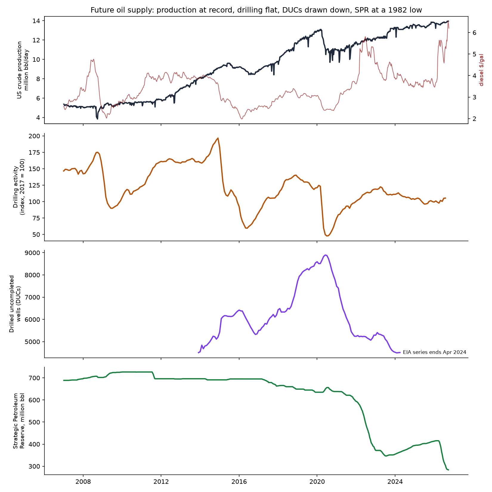
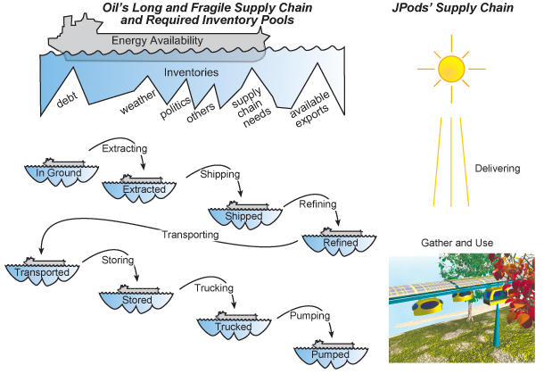

# Record Diesel, Disposable Energy, and Unemployment — October 2026

*Life requires energy. Less affordable energy, less life.*

**Disposable Energy** is how much energy people can buy with their take-home pay. It measures
the input to the economic flywheel: labor applying affordable energy. Because the flywheel has
momentum, a loss of Disposable Energy shows up in jobs only after a delay.

## Where we are

| | Value | Source |
|---|---|---|
| Diesel, record week (Sep 21, 2026) | **$6.53/gal** — above the June 2022 record of $5.81 | EIA via FRED `GASDESW` |
| Diesel, latest week (Oct 5, 2026) | $6.20/gal | same |
| Diesel, 12-month change (Sep 2026) | **+68%** | same |
| Gasoline, 12-month change (Sep 2026) | +38% | FRED `GASREGW` |
| Disposable Energy per person (1986 = 0) | **+0.66 in Jan 2026 → +0.06 in May → +0.18 in Aug** | FRED `A229RC0`, `GASREGW` |
| Unemployment (Sep 2026) | 4.2% | BLS via FRED `UNRATE` |

The diesel record is in nominal dollars. Adjusted for inflation, it roughly matches the June 2022
peak ($6.52 in today's dollars) and is below June 2008 ($7.19). The *speed* of the change is what
matters most for what comes next: Disposable Energy per person lost 0.60 in four months — the
fastest four-month drop since monthly data begin in 1990. The next largest (2020–21) were swings
in stimulus income, not energy.

## What the record says happens next

From 1977 to 2019, a rise in gasoline prices was followed by rising unemployment
**16 to 24 months later**, strongest at 18 months (r = 0.33). Diesel alone shows the same timing,
strongest at 17 months, but weaker (r = 0.29, 1995–2019). See [README.md](README.md) and
`output/results.json`.

Applied to a shock that began in March 2026 and peaked in September 2026:

- **Late 2027 through 2028** is the window when the job effects would be expected to arrive.
- **Before then, prices.** Trucks carry most US freight, and farms, construction, and mining run
  on diesel. Diesel costs pass into the price of food and goods within months, cutting
  Disposable Energy a second time through everything people buy, not just fuel.
- **Momentum hides it.** GDP and unemployment can look healthy through 2027 while the flywheel's
  input has already fallen. That is the pattern of 1998–2008: Disposable Energy peaked in 1998;
  GDP gave no warning before 2008.

The last comparable shock is a guide to the size: gasoline peaked in mid-2022, and unemployment
rose from 3.4% (April 2023) to 4.2% (July 2024). That rise was modest, likely cushioned by
COVID-era money printing still in the economy. Whether money printing cushions this shock, or
adds to the debt drag instead, is the open question.

## Future supply: drilling, DUCs, and the SPR



| | Value | Source |
|---|---|---|
| US crude production (Sep 25, 2026) | **13.96 million bbl/day — a record** | EIA weekly |
| Drilling activity (Aug 2026, 2017 = 100) | **105** — about half the 2014 peak (189), below 2019 (138) | FRED `IPN213111N` |
| Drilled-uncompleted wells (DUCs) | **8,894** peak (Jun 2020) → **4,510** (Apr 2024, last published) | EIA DUC data |
| Strategic Petroleum Reserve (Sep 25, 2026) | **284 million bbl** — lowest since October 1982; down 130 million in 2026; 727 million at its 2010 peak | EIA weekly |
| Distillate (diesel) stocks, reported (Sep 25, 2026) | **105 million bbl, 27.9 days of supply — the lowest for late September in the records** (stocks since 1982, days since 1991); 2022 was next at 111 million and 29.9 days | EIA weekly |

**Rig count leads oil output by years.** Production can stay at a record for a while on wells
already drilled. From 2020 to 2024, DUC drawdown let output climb while drilling ran at half its
2014 level. That cushion is largely spent: by April 2024 DUCs were back near their 2014 level, and
EIA stopped publishing the series. Drilling has barely responded to record prices (99 → 105 this
year). New supply depends on new drilling, which shows up a year or more later.

**The buffer is thin.** The SPR holds about two weeks of US petroleum consumption. Drawing it down
cushioned 2022 and this year. With the reserve at a 1982 low, the next supply shock arrives with
less cushion — and the pass-through to Disposable Energy and, 16–24 months later, to jobs, is
less dampened.

**Oil is not running out; capital and lead time are the constraint.** Vast amounts of oil remain.
Oil companies are highly adaptive in the short term — our own 2021 projection of falling US output
was wrong because operators completed drilled wells faster and drilled more productively than
expected. The long term is fixed by capital and geology: new supply takes **2 to 10 years** and
large capital to develop. The risk is not geology. It is a **capital collapse** — when the capital
and supply chains that extract, ship, refine, and deliver oil fail, oil famine follows even where
oil is plentiful.

**Syria is the case study.** Syria has oil. Its production peaked in 1996 and declined with
depletion and underinvestment until it became a net importer of fuel. With falling oil revenue,
the government cut diesel subsidies in 2008, roughly tripling the price of diesel during a severe
drought; farmers who could no longer pump water or run machinery moved to the cities. Unrest
began in 2011. War and sanctions then cut production by about 95%, and mass migration followed.
Oil famine is a capital and supply-chain collapse, not an absence of oil.



**The crisis is at hand long before the snap.** Oil reaches people through a long chain —
extracting, shipping, refining, transporting, storing, trucking, pumping — and every link needs an
inventory pool to absorb shocks from debt, weather, politics, and available exports. Syria shows
the sequence: the pools drain first, prices rise, and people compensate by scrambling to keep the
upside-down pyramid in balance. That scramble is sand in the bearings of the flywheel. The economy
looks intact until people can no longer compensate — then it snaps.

The US pools are draining now. **DUCs** are the inventory between drilling and extraction, down by
half since 2020. The **SPR** is the national storage pool, at a 1982 low. **Diesel** at record
prices is the trucking and pumping links straining. Each is measurable before the snap. A
solar-powered network gathers and uses its energy where it is delivered, with no long chain of
pools to drain.

**Reported inventory overstates usable inventory.** Distillate stocks as reported include the oil
needed to fill pipelines, terminals, and the delivery system — inventory that cannot be withdrawn
without the system ceasing to deliver. Usable inventory = reported inventory − that operational
floor, and the floor is not published. A good rule of thumb (Bill James): **19–20 days of supply
are required just to fill the supply chain.** On that rule, the 27.9 days reported leaves a usable
cushion of only **about 8–9 days** — roughly 2% of the 365-day food cycle that farming, food
processing, and trucking run on diesel. In late September 2022, the previous low, the same rule
left about 10–11 days. Measuring the operational floor precisely is an open question for industry
and academic reviewers.

**Paths to war are clear long before the wars cascade.** The same is true of oil famine: the pools
drain, prices rise, and people compensate — all visible, all measurable — before the snap.

## Precedent: "Gas Lines Coming This Fall" (July 2008)

On July 15, 2008, Bill James published *Gas Lines Coming This Fall* (Seeking Alpha). The argument
was this readme's argument: oil moves through a long and fragile supply chain; inventory pools at
each link absorb shocks; US crude inventories were down to about 19 days of supply and falling;
and with the pools thin, a single weather, political, or debt event could cause shortages. It
named the Gulf of Mexico hurricane season as the specific risk — *"We have allowed our entire
economy to be at risk from a single weather event."*

In September 2008, Hurricanes Gustav and Ike shut Gulf Coast refineries, and gas lines and empty
stations spread across the Southeast. The mechanism and the timing were right.

Scored honestly, two calls were too large: shortage prices of $6–8 a gallon, and world oil exports
falling to a third by 2011. Both underestimated how adaptive the oil industry is in the short term
— the same lesson as the 2021 rig-count projection. The inventory-pool warning held; the
magnitude forecasts did not. That is the standard to hold this readme to.

## Intermittent: the sun or oil?

People call solar intermittent and oil reliable. That is driving while looking in the rear-view
mirror: it works only while the road is straight. Syria, the oil wars, and today's supply shock
show the road curving.

| | Sun | Oil |
|---|---|---|
| Interruption | Every night, every winter | 1973, 1979, 1990, 2005, 2008, 2022, 2026 … |
| Predictable? | To the second, years ahead | No — weather, politics, debt, war, capital |
| Who controls it | Geography and the calendar | Foreign exporters, capital markets, supply chains |
| Storage the system already runs on | Batteries and microgrids sized to the night and the season | SPR, crude and product stocks, 19–20 days just to fill the pipes |

**The sun setting is a storage problem, not a reliability problem.** Oil already depends on storage
at every link — the inventory pools in the supply chain above. The difference is that the sun's
interruptions are known in advance and sized by the calendar, while oil's arrive without warning
and are sized by events no city controls. The harder engineering for solar is the seasonal and
multi-day cloudy stretch, not the night; that, like new oil supply, is a question of capital.

**Life solved this long ago.** Trees do not die overnight or in winter; they store the sun's energy
and draw on it. We grow crops to feed ourselves over winter — the harvest is a seasonal battery,
and the 365-day food cycle is stored sunshine. Civilization has always lived on stored solar
energy. Oil is the exception: sunshine stored by geology, drawn down once, delivered through a
chain of pools we do not control.

Thomas Edison saw it in 1910:

> "Sunshine is spread out thin and so is electricity. Perhaps they are the same… This scheme of
> combustion to get power makes me sick to think of—it is so wasteful… When we learn how to store
> electricity, we will cease being apes ourselves… Sunshine is a form of energy, and the winds and
> the tides are manifestations of energy… Do we use them? Oh, no! We burn up wood and coal, as
> renters burn up the front fence for fuel. We live like squatters, not as if we owned the
> property… There must surely come a time when heat and power will be stored in unlimited
> quantities in every community, all gathered by natural forces. Electricity ought to be as cheap
> as oxygen…"
>
> — Thomas Edison, 1910 interview

> "I'd put my money on the sun and solar energy. What a source of power! I hope we don't have to
> wait 'til oil and coal run out before we tackle that."
>
> — Thomas Edison to Henry Ford and Harvey Firestone, 1931, as recalled by James Newton,
> *Uncommon Friends* (1987)

Edison named the problem exactly: not that sunshine is unreliable, but that we had not learned to
**store** it — in every community.

## Limits

- Correlation around 0.3 means energy prices explain roughly a tenth of the change in
  unemployment. It is a consistent leading signal, not a forecast of a specific number.
- These are national averages. The economy is a confederation of upside-down pyramids: freight-
  and farm-dependent regions feel diesel first and hardest.
- The concept of Disposable Energy is open for review. Academic contributions welcome:
  bill@jpods.com.

## The structural point

Diesel shocks hit hardest where freight moves on roads. Freight railroads move a ton about 470
miles per gallon; trucks are far less efficient per ton-mile. Federal highways shifted freight
from rail to trucks, so every diesel shock now reaches deeper into the cost of living. Energy
self-reliance — solar-powered, grade-separated networks for people and Middle Mile cargo — is
how a city stops importing these shocks.

## Reproduce

```bash
python3 disposable_energy.py   # builds the 1986 base and lag tests
python3 diesel_check.py        # current diesel, Disposable Energy, diesel lag test -> output/diesel_check.json
python3 supply_check.py        # production, drilling, DUCs, SPR -> output/supply_check.json, oil_supply.png
```
